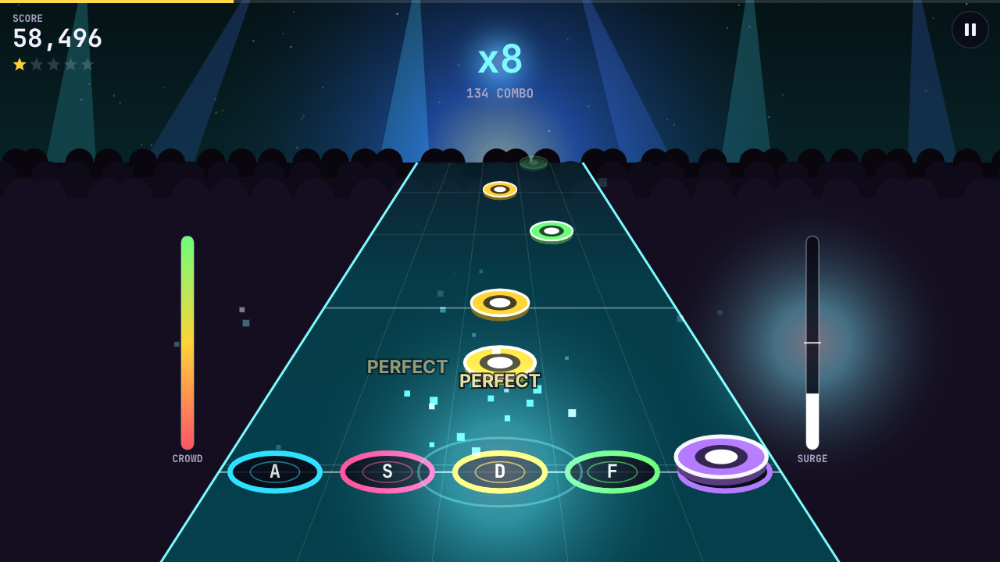
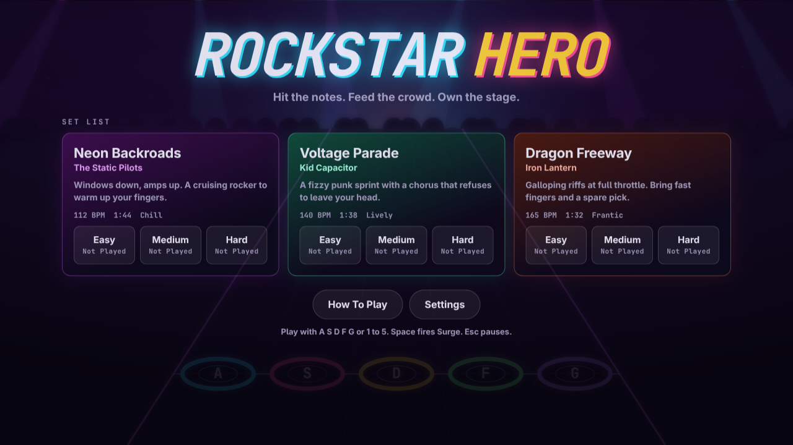
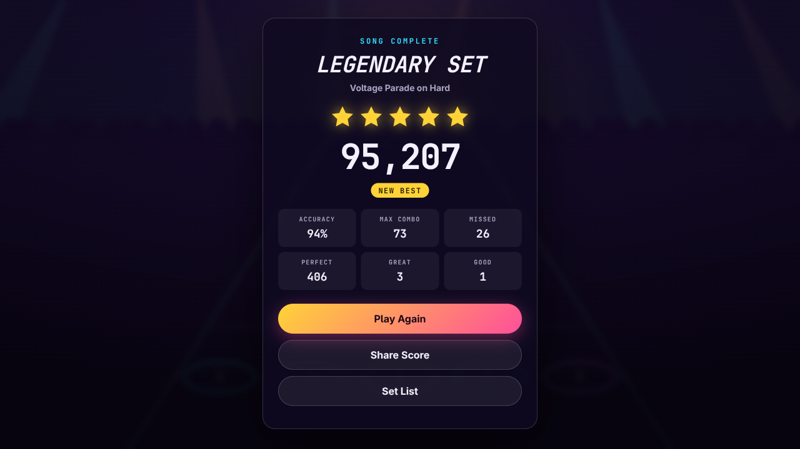
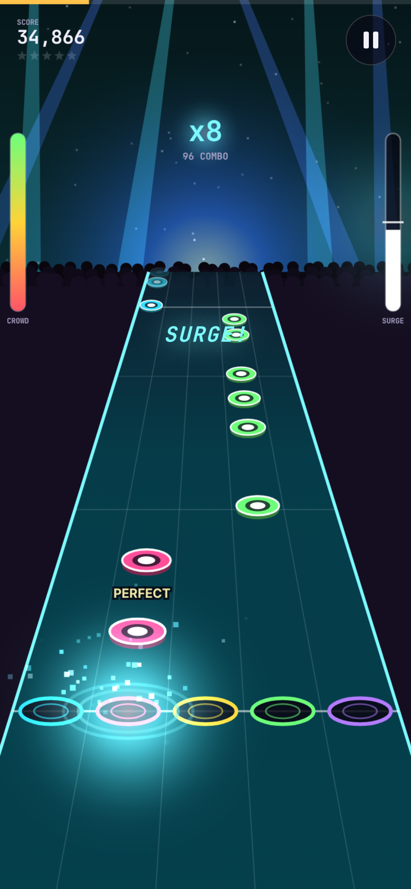
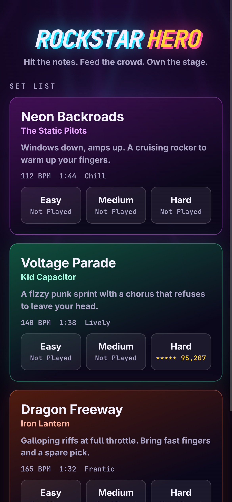

<div align="center">
  
  <h1 align="center" style="border-bottom: none">Rockstar Hero</h1>
  <h3 align="center">a five lane rhythm game with synthesized rock songs, built with typescript, canvas, and webaudio</h3>
</div>

<br />

Notes roll down the highway. Hit them on the line, chain combos, fire Surge to double your score, and keep the crowd from walking out. Three original songs, three difficulties each, and every sound is synthesized live in your browser. No downloads, no login, no audio files.

## Quick Start

```bash
npm install
npm run dev
```

Open http://127.0.0.1:5187 and pick a song.

## Controls

| Action | Keyboard | Phone |
|---|---|---|
| Hit a lane | `A` `S` `D` `F` `G` or `1` to `5` | Tap the lane |
| Hold a sustain | Keep the key down | Keep your finger down |
| Fire Surge | `Space` | Tap the Surge meter |
| Pause | `Esc` or `P` (again during the countdown to stay paused) | Pause button |
| Audio offset | Settings or the pause menu | Settings or the pause menu |

## How It Plays

### Scoring

- **Timing grades**: Perfect, Great, and Good, worth 100, 75, and 50 points
- **Combo multiplier**: every 10 notes in a row adds one, up to x4
- **Sustains**: notes with a tail pay out for as long as you hold them
- **Stars**: up to five per song, based on how many notes you hit and how cleanly. Combo and Surge do not count, so hitting about half the notes earns three stars

### Surge

- **Charge it**: hit every starred note in a phrase to fill a quarter of the meter
- **Fire it**: at half a meter or more, Surge doubles your multiplier, up to x8
- **Crowd boost**: hits win the crowd back twice as fast while Surge runs

### Crowd Meter

- **Misses drain it**: and the lead guitar cuts out until your next hit
- **Empty means over**: the show ends early when the crowd walks out
- **Harder is harsher**: you can hold steady hitting about 40% of notes on Easy, 50% on Medium, and 60% on Hard
- **Fair starts**: the meter starts well above half, a missed chord costs one miss, and warm up taps during the count in are free

## Set List

| Song | Artist | BPM | Feel |
|---|---|---|---|
| Neon Backroads | The Static Pilots | 112 | Cruising rock in E minor |
| Voltage Parade | Kid Capacitor | 140 | Punk sprint in A minor |
| Dragon Freeway | Iron Lantern | 165 | Galloping metal in D minor |

Songs and bands are original and fictional. Each song is a short text score in `src/game/songs/`. The lead guitar, rhythm guitar, bass, and drums are all built from it, and so are the note charts, which is why the notes always land on what you hear.

## Screenshots

<div align="center">
  
  <br /><br />
  
  <br /><br />
  
  &nbsp;
  
</div>

## Tech Stack

| Layer | Choice |
|---|---|
| Language | TypeScript, strict mode |
| Build | Vite |
| Graphics | Canvas 2D with a hand rolled perspective projection |
| Sound | WebAudio: oscillators, noise, filters, and a wave shaper for the guitar amp |
| Tests | Vitest |
| Runtime dependencies | None |

## Project Layout

```
src/
  game/     Pure logic: songs, chart builder, judge, scoring, storage
  audio/    WebAudio synth, mixer, and the song clock
  render/   Canvas drawing: highway, notes, effects, HUD
  app/      Screens, input, and the game loop
```

## Scripts

```bash
npm run dev        # dev server on port 5187
npm run build      # type check, then build static files into dist/
npm run preview    # serve dist/ on port 5188
npm run test       # unit tests
npm run typecheck  # type check only
```

`npm run build` produces a fully static `dist/` that uses relative paths, so it can be served from any folder on any static host.

## Adding A Song

1. Copy a file in `src/game/songs/` and give it a new `id`
2. Write each bar of the lead guitar as 16 characters, one per 16th note: `0` to `9` for a scale degree, `a` to `j` for a power chord, `-` to hold, `.` to rest
3. Pick a drum, rhythm guitar, and bass style for each section
4. Add it to the list in `src/game/songs/index.ts`
5. Run `npm run test`. The chart tests check every song on every difficulty

## Test And Demo Flags

- `?bot=1` lets the computer play, for demos
- `?headless=1` runs the loop on a timer and never auto pauses, for automated tests in a window that is not on screen

## Share Link

The results screen has a Share Score button. It opens the phone share sheet, or copies a one line brag to the clipboard. The link defaults to https://rockstar-hero.grok.me. Set `VITE_SHARE_URL` at build time to change it.

## Optional Analytics

Set `VITE_ANALYTICS_SRC` and `VITE_ANALYTICS_ID` at build time to load an Umami compatible tracker. With neither set, the game makes no network requests after it loads.

## License

MIT. See [LICENSE](LICENSE).
